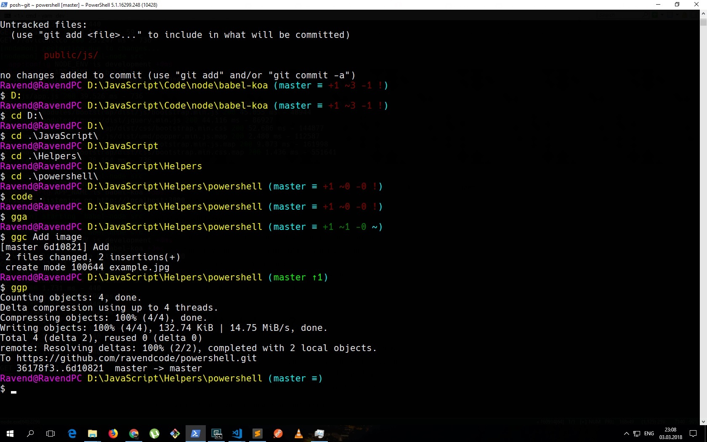

# PowerShell Profile

## Install posh-git

1. In powershell `Test-Path $profile`
2. Create new profile `New-Item -path $profile -type file –force`
3. Edit `Microsoft.PowerShell_profile.ps1`
4. Change path in profile for `Import-Module 'E:\JavaScript\Helpers\powershell\posh-git-develop\src\posh-git.psd1'`
4. Copy `Microsoft.PowerShell_profile.ps1` to `C:\Users\Ravend\Documents\WindowsPowerShell`
5. Reload profile `. $PROFILE`
