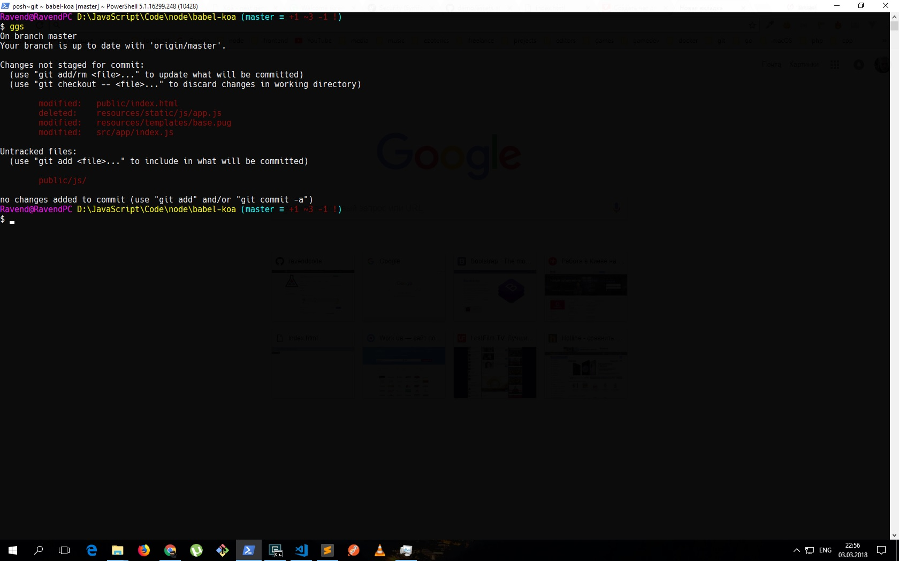

# PowerShell Profile

## Install posh-git

1. In powershell `Test-Path $profile`
2. `New-Item -path $profile -type file –force`
3. Edit `Microsoft.PowerShell_profile.ps1`
4. Copy`Microsoft.PowerShell_profile.ps1` to `C:\Users\Ravend\Documents\WindowsPowerShell`
5. `cd posh-git-develop`
6. `.\install.ps1`
7. `. $PROFILE`
